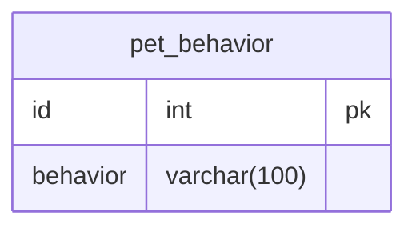
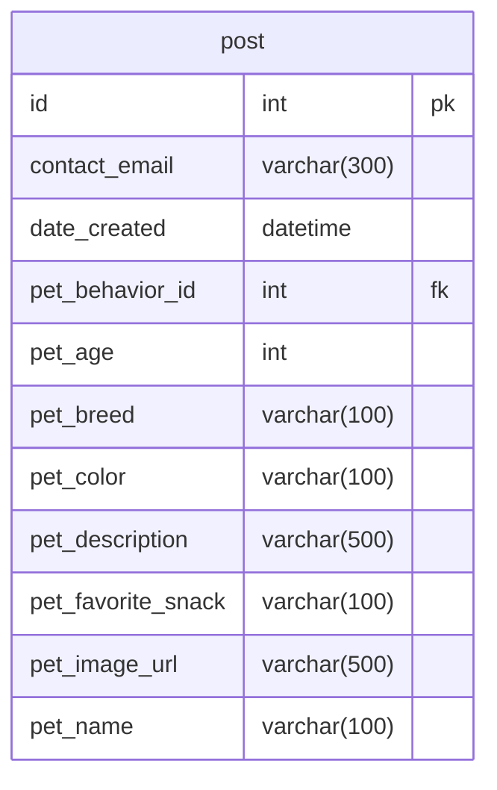

`Any terminal commands or python code will appear in code blocks like this one`

_More information about the Models and the Views will be at the bottom_

# PET-FOUND

_This is one of my solo projects using Python and Django to make a RESTful API. The purpose of this project is to showcase the steps taken to setup a project from start to finish. At the end of the project I will show you how to clone it to your computer and test out the project yourself using VS Code._

Technology we will be using:

1. Python
2. Django
3. SQLite

Tools we will be using:

1. Visual Studio Code
2. Terminal

## Project setup

This project will assume you have installed Python / Django / Pip /

1. In your computer's workspace (where you store your projects) create a folder with your project's name: ~/workspace/python/pet-found

2. In your terminal cd into the directory and run the command to install the shell -> install django -> add a django project to the directory (which we will call app) -> add a python app (which we will call api) -> install rest framework -> install django cors headers

```bash
pipenv shell
pipenv install django
django-admin startproject app .
python3 manage.py startapp api
pip install djangorestframework
pip install django-cors-headers
```

3. Once the installation is done open up the propject in visual studio code

```bash
code .
```

4. Delete the following files for a fresh start:

- views\.py
- admin\.py
- models\.py
- test\.py

<!-- Do i need an interpreter??? -->

<!-- Select the project interpreter in visual studio -->

5. In the debug tools create a launch.json file -> select the python debugger -> select Django

6. In the app/settings.py file you will need to do the following:

_Note: Some authentication stuff is here incase I end up using it in the near future_

- Add the following apps to the INSTALLED_APPS variable:

```python
# project setup
"rest_framework",
"rest_framework.authtoken",
"corsheaders",
"api",
```

- Add the REST_FRAMEWORK variable underneath the INSTALLED_APPS variable:

```python
# project setup
REST_FRAMEWORK = {
"DEFAULT_AUTHENTICATION_CLASSES": (
"rest_framework.authentication.TokenAuthentication",
),
"DEFAULT_PERMISSION_CLASSES": [
"rest_framework.permissions.IsAuthenticated",
],
}
```

- Add the CORS_ORIGIN_WHITELIST variable underneath the REST_FRAMEWORK variable:

```python
# project setup
CORS_ORIGIN_WHITELIST = (
"http://localhost:3000",
"http://127.0.0.1:3000",
"http://localhost:5173",
"http://127.0.0.1:5173",
)
```

- Add the following to the MIDDLEWARE variable:

```python
# project setup
'corsheaders.middleware.CorsMiddleware',
```

7. Add a models folder and package file in the api folder example: ~project/api/models/\_\_init\_\_.py

_More information about the models in the Models section_

8. I added the 2 models and imported them into the package file (\_\_init\_\_.py)

9. Once the models are finished, migrate the data using the following steps:

- In the terminal run the following commands:

```bash
python3 manage.py makemigrations
python3 manage.py migrate
```

_Once the migrations were done I proceeded to setup the views._

10. Add a views folder and package file in the api folder: ~project/api/views/\_\_init\_\_.py

_More information about the views in the Views section_

_At this point we can update our urls\.py file to include our newest view._

11. Imported the newly created view into the urls\.py file

```python
from api.views import PetBehaviorViewSet
```

12. Register the new route

```python
router.register(r"petbehaviors", PetBehaviorViewSet, "petbehavior")
```

13. Test your endpoint!

_I tested the first endpoint using Postman and it worked! (right now it is an empty array with a status of 200)_

To make the initial data seed easier I am going to be adding initial data in the fixtures folder and a script to run the command.

14. Make a fixtures folder in the api directory: ~/project/api/fixtures/

15. I added a pet_bahaviors.json file to include my initial data for that model. Here is an example of 1 of them:

```python
[
    {
        "model": "api.petbehavior",
        "pk": 1,
        "fields": {
            "behavior": "Runs away"
        }
    }
]
```

16. In the root directory I added a seed_database.sh file with the following:

```python
#!/bin/bash
rm db.sqlite3
rm -rf ./api/migrations
python3 manage.py migrate
python3 manage.py makemigrations api
python3 manage.py migrate api
# python3 manage.py loaddata users
# python3 manage.py loaddata tokens
python3 manage.py loaddata pet_behaviors
```

_I commented out users and tokens because we will not be using these at this time._

17. Next I ran this command to make the executable script:

```bash
chmod u+x ./seed_database.sh
```

18. Next I ran this command to test the script:

```bash
./seed_database.sh
```

It worked! My first model is done, my first view that gets the list is done (empty array), and the initial data is seeded for that model!

Now I am going to do the same with the next model and view then test out the endpoint.

Great, now that we moved past the initial setup we can start working on the rest of the project which consists of adding more views to the api.

_Since the models are finished we just need to add the views to be able to perform CRUD features_

## Models

Here is the link to view the ERD:

https://dbdiagram.io/d/pet-found-6648f1b5f84ecd1d2288b39a

_Let us take a look at the models_

- The first model is for the pet behaviors. Each post will require to choose one pet behavior reference.

- The max character length will be 100 characters



The reason that I included this table in the project was to give the users a fixed set of options to choose from. Most posts about lost and found pets do not specify if the pet is friendly or runs away, which is why I wanted to include that here so that it can be chosen when creating a post.

- The next model will be the main content (post) to display.



contact_email - user that lost or found the pet can write their email down.
date_created - this field will automatically be inserted when a post is created.
pet_behavior_id - this is a reference to the pet_behavior table.
pet_age - the use can specify the age (approximate) of the pet.
pet_breed - the user can specify a short description about the pet's breed.
pet_color - a short description about the color of the pet.
pet_description - this will be a text field with a max characted limit of 500. this field is to get more details about the pet.
pet_favorite_snack - this can be helpful for people who lost pets.
pet_image_url - at this time i will only include a way to add urls.
pet_name - if the pet has a colar this can be used for the pet name

## Views

_At this time anyone can create, read, update and delete the data. I will implement authorization at a later time._

The first view I added is the pet behavior view. This is responsible for any http requests in the /petbehaviors url.

The view has 5 methods: create, destroy, list, retrieve, update

The create method will:

1. Extract the data that was sent in a POST request.
2. Check if any of the data is missing.
3. Create a new pet behavior and add it to the database.
4. Serialize the new data.
5. Returns the data with a 201 status.

The destroy method will:

1. Take the primary key from the url.
2. Checks if a primary key was given.
3. Attempt to retrieve the data that matches the primary key.
4. Deletes the data from the database.
5. Returns a 204 status.

The list method will:

1. Get all of the pet behaviors from the database.
2. Serialize the data.
3. Returns the serialized data and a 200 status.

The retrieve method will:

1. Take the primary key from the url.
2. Checks if a primary key was given.
3. Attempt to retrieve the data that matches the primary key.
4. Serialize the data.
5. Returns the serialized data and a 200 status.

The update method will:

1. Take the primary key from the url.
2. Checks if a primary key was given.
3. Extract the data that was sent in a PUT request.
4. Attempt to retrieve the data that matches the primary key.
5. Serialize the request data.
6. Check if the request data is valid.
7. Extract the updated data from the validated data.
8. Update the existing information with the new data (not the date created).
9. Returns a 204 status.

The second view I added is the post view. This is responsible for any http requests in the /posts url.

Just like before the view has 5 methods: create, destroy, list, retrieve, update.

The create method will:

1. Extract the data that was sent in a POST request.
2. Check if any of the data is missing.
3. Attempt to retrieve an existing pet behavior instance.
4. Create a new post and add it to the database.
5. Serialize the new data.
6. Returns the data with a 201 status.

The destroy method will:

1. Take the primary key from the url.
2. Checks if a primary key was given.
3. Attempt to retrieve the data that matches the primary key.
4. Deletes the data from the database.
5. Returns a 204 status.

The list method will:

1. Get all of the posts from the database.
2. Serialize the data.
3. Returns the serialized data and a 200 status.

The retrieve method will:

1. Take the primary key from the url.
2. Checks if a primary key was given.
3. Attempt to retrieve the data that matches the primary key.
4. Serialize the data.
5. Returns the serialized data and a 200 status.

The update method will:

1. Take the primary key from the url.
2. Checks if a primary key was given.
3. Extract the data that was sent in a PUT request.
4. Attempt to retrieve the data that matches the primary key.
5. Serialize the request data.
6. Check if the request data is valid.
7. Extract the updated data from the validated data.
8. Update the existing information with the new data (not the date created).
9. Returns a 204 status.

## Testing the endpoints

Here is how I tested the both endpoints:

_I used the Postman extention to test the endpoints_

1. Start the program using the debugger.
2. In postman I used the following url to...

_Get the list or submit a post request_

- `http://localhost:8000/posts`
- `http://localhost:8000/petbehaviors`

_Get a single item from the list, update a single item from the list, delete a single item from the list_

_Finds the item with the id of 1_

- `http://localhost:8000/posts/1`
- `http://localhost:8000/petbehaviors/1`
